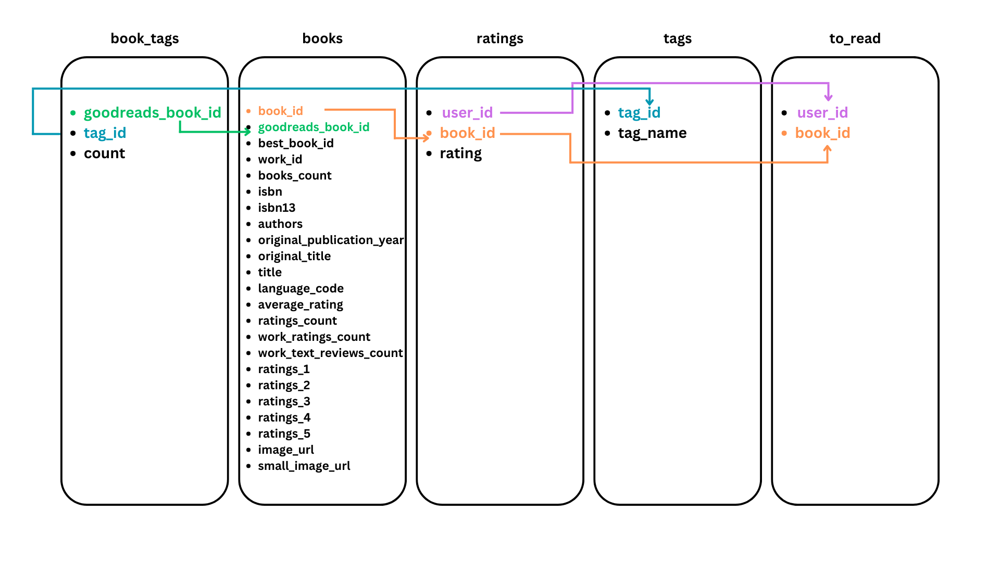
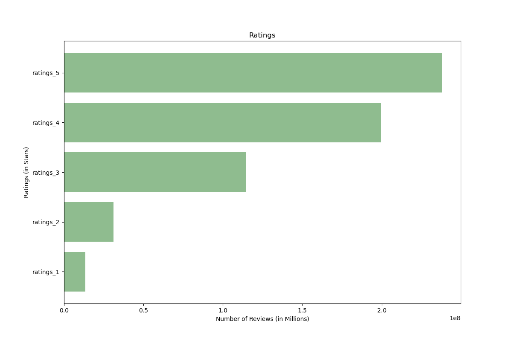
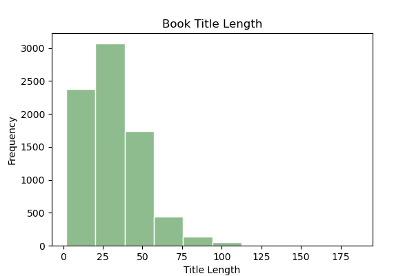
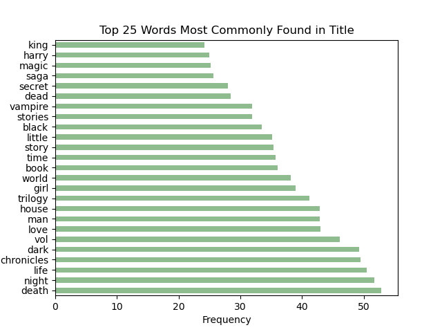
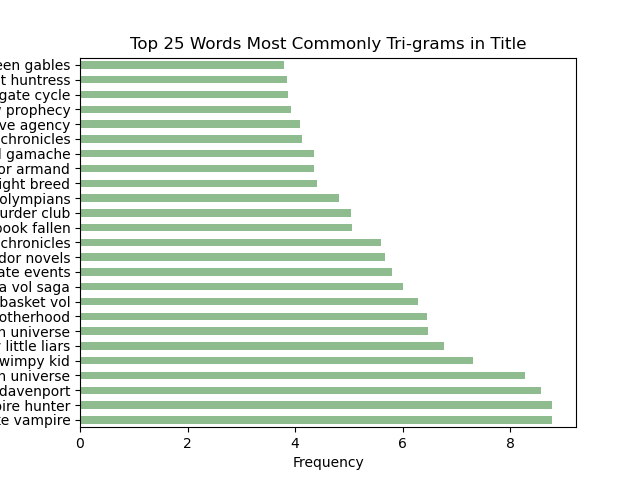
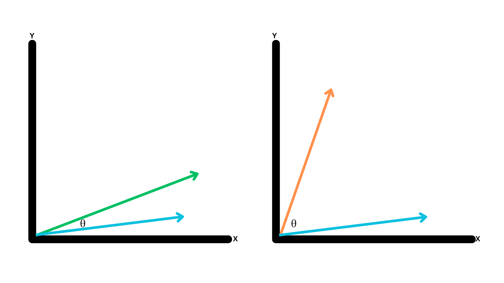

# Capstone Project - Book Rating Classifier & Recommender System


<p align="center">
  
</p>


### Problem Statement:


There's an _indescribable_ joy that accompanies the act of immersing oneself deep in the pages of a good book. The sheer delight of losing track of time while navigating the intricate landscapes of words, where characters come alive, and stories unravel like enchanting tapestries, is unmatched. Each book is a doorway to a new adventure, a chance to live a thousand lives, and an invitation to explore endless possibilities. Every devoted reader knows the inescapable obstacle that is conquering the dreaded book hangover. A "book hangover" is defined by [Epic Reads](https://www.epicreads.com/blog/symptoms-of-a-book-hangover/#:~:text=A%20book%20hangover%20is%20condition,quality%20enters%20the%20reader's%20life.) as a "condition in which attachment to a book or series that has ended causes the reader traumatic emotional distress". A book hangover can last for a few weeks, or until a new book of higher-than-average quality enters the reader’s life.

This is when readers turn to their **TBR (to-be-read) list.** A TBR list is a collection of books that an individual plans to read in the future. Many avid readers maintain TBR lists to help prioritize their reading choices and ensure they don't forget about books they want to experience. The unfortunate aspect of this list is that it is ever growing and multiplies much quicker than the reader can keep up with. While assisting a reader in accelerating their book consumption isn't within my capability, aiding them in selecting the next compelling read from their TBR list is within my scope of assistance. 


Determining the book that will aid a reader in recovering from a book hangover is the primary objective of this project. The goals of this endeavor encompass two key aspects:

1. Creation of a predictive model to forecast what books from a reader's TBR list should be read next, with at least 51% accuracy 
2. Creation of a recommendation system, based off of nearly 6 million book ratings, to help readers continue to add to their TBR list

_This capstone is a passion project of mine, thank you for following along!_


### File Directory:

```
CAPSTONE
|__ code
|   |__ 01-EDA.ipynb
|   |__ 02-Cleaning.ipynb   
|   |__ 03-Recommender.ipynb
|   |__ 04-Modeling.ipynb 
|   |__ 05-DataFrame-Creation-TBR-List.ipynb     
|__ data
|   |__ books_for_binary_classification.csv
|   |__ recommend_big.csv
|   |__ recommend.csv
|   |__ tbr_list.csv
|__ ignore
|   |__ books_tags.csv
|   |__ books.csv
|   |__ ratings.csv
|   |__ tags.csv
|   |__ to_read.csv
|__ images
|   |__ amt_of_ratings_by_stars_eda.png
|   |__ book_id_pub_year.png
|   |__ book_title_length.png
|   |__ book_title_word_count.png
|   |__ bookimage.png
|   |__ books_heat_map.png
|   |__ cosine_similarity.png
|   |__ data_erd.png
|   |__ num_ratings_by_stars_eda.png
|   |__ Ratings_Distribution.png
|   |__ Should_i_read_next_Distribution.png
|   |__ silly_sorting_hat.png
|   |__ Top 10 Most Frequently Published Authors.png
|   |__ Top 10 Most Frequently Published Language Codes.png
|   |__ top_25_most_common_tri_grams_in_titles.png
|   |__ top_25_most_common_words_in_titles.png
|__ Capstone - Kiersten Johns.pdf
|__ README.md
|__ streamlit_app.py
```


# Data Dictionary:

|Name|Dataset|Description|
|---|---|---|
|**books**|books_for_binary_classification.csv| 7,851 of the current "top 10,000 most popular books".
|**recommend**|recommend_big.csv| 5,419,126 book ratings from GoodReads.
|**tbr list** | tbr_list.csv | My personal TBR list, comprised of 28 books, to be used as unseen data to check predictions.


# Executive Summary:

### EDA:
The original GoodReads dataset came from [user zygmuntz's github](https://github.com/zygmuntz/goodbooks-10k/tree/master) and consisted of the following data:

|Name|Dataset|Description|
|---|---|---|
|**book tags**|book_tags.csv| Contains tags/shelves/genres assigned by users to books. Tags in this file are represented by their IDs. They are sorted by goodreads_book_id ascending and count descending.
|**books**|books.csv| Top 10,000 most popular books containing metadata for each book (goodreads IDs, authors, title, average rating, etc.). The metadata has been extracted from GoodReads.
|**ratings**|ratings.csv| Contains 6 million ratings sorted by time.
|**tags** | tags.csv | Translates tag IDs to names.
|**to read** | to_read.csv | Provides IDs of the books marked "to read" by each user, as user_id,book_id pairs, sorted by time. There are close to a million pairs.

    

**Below is a ERD (Entity Relationship Diagram):**

<p align="center">
  
</p>

After exploring all separate datasets, here are the key findings:

- The Top 10 Most Frequently Published Authors
<p align="center">
  
</p>

- There were 9,964 unique book titles. Some titles were duplicates, however, they were still unique books due to the fact that they had different authors. 

- The earliest publishing date is listed as -1750 and the newest publishing date is listed as 2017

- Multiple language codes are included in the list of 10,000 books. Here are the Top 10 Most Frequently Published Language Codes
<p align="center">
  
</p>

- 6 million books reviews (ratings) were provided, on a scale of 1-5, with 5 being the best rating. Here is the distribution of the ratings:
    - As can be seen, most of the ratings are 4's and 5's. Given the context of the data (the top 10,000 most popular books) this makes sense.
<p align="center">
  
</p>

- There were 34,252 unique tags provided by users 

- Here is the distribution of Title Length (by character)
    - As can be seen, the data is skewed right, with the majority of the titles being under 50 characters long. 
<p align="center">
  
</p>

- Let's take a look at this same distribution, but instead of character count, lets take a look at the word count.
    - Again, this data is skewed right, with the majority of book titles being under 10 words long
    - The longest title was 33 words long!
<p align="center">
  
</p>

- Then, the top 25 most common words and trigrams of the titles were explored. Below are the findings:
<p align="center">
  
</p>

<p align="center">
  
</p>

### Cleaning:

#### Cleaning for the Recommendation System:

The ratings data encompassed 6 million reviews from GoodReads users. While more data is better... the initial assumption was that my computer could not handle creating a system using all 6 million reviews. To address this issue, a recommendation system was built off of a random sample of 50,000 data points. Knowing that the recommender would improve with additional data points, more points were continuously added and put through the process of being turned into a recommender. This process is elaborated on in the section labeled **Recommender System**. During each iteration of selecting random data points, a check was performed to ensure the inclusion of some of my favorite books in the sample, as a good recommender system should encompass personal preferences. To my delighted surprise, computing power was not actually an issue, and the last recommendation system was eventually developed using the entire dataset of nearly 6 million data points.

For the recommendation system, essential features included _user_id, rating, and title_. Therefore, a merge of the book dataframe and the ratings data frame was required in order to obtain all necessary info. This was achieved via a left merge on the _book_id_. Further data refinement involved the exclusion of books not published in US - English (language code = eng or en-US). This resulted in a dataset of 5,419,126 data points to be worked with. Fortunately, no missing values were included in this dataset. Once the data was cleaned, extraneous features were dropped, and the updated CSV was saved.

#### Cleaning for Predictive Modeling:

The predictive models use the books dataset of the top 10,000 most popular books on GoodReads. Again, the initial thought was that computing power would not be able to handle data from all 10,000 books due to the use of the process of dummying categorical columns. Therefore, a dataframe including the top 1,000 books was created. But, upon seeing the disrtibution of ratings, it was quickly realized that including the top 1,000 books was not going to equate to a fair model due to the fact that the data was not a random sample. 

To fix this issue, a random sample of 1,000 books was created to start the modeling process. Again, upon inspection, this was also creating unfair models due to the fact that there were no ratings below 3 stars. At this point, my ambition decided to include all 10,000 books and hope that my computer could handle it (spoiler alert - it could!). 

With the goal being to create a model to find the reader's _next great read_, the original thought was to create a multi-class classification model, where the classes would be the star ratings. This model would be used to predict the average rating of a book and could be used to identify the next great read as any book that is predicted to have an average rating of 4 or above. To do this, I rounded all of the average ratings to their nearest whole number (nearest star). This created issues in the modeling process, as outline in the **Modeling Process** section below. 

Therefore, a pivot to the creation of a binary classification model was necessary. The feature _average_rating_ was utilized to create the new feature _should_i_read_, which is described as the following: 
- Books with an average rating over 4 stars mapped to a 1, indicating that a reader should read this book next
- Books with an average rating below 4 stars mapped to a 0, indicating that a reader should still read this book, but it is not going to be their next great read to pull them out of their book hangover

Two different binary classification models were created. One was based solely off of the NLP (Natural Language Processing) of the author's name and title of the book, which is information that any reader would have readily available about a book they wish to read. The second model was based off of more information that a reader could acquire with a visit to the books' GoodReads page, if they so wish. The cleaning process for these two models are outlined below:

- NLP
    - Language code: As mentioned previously, books with language codes determined not to be US english were dropped 
    - Features necessary were _authors_, _title_, and _should_i_read_. All others were dropped. 
 
- Other model
    - Language code: As mentioned previously, books with language codes determined not to be US english were dropped 
    - Features necessary were _original_publication_year, _ratings_count_, _ratings_1_, _ratings_2_, _ratings_3_, _ratings_4_, _ratings_5_, and _should_i_read_. All others were dropped. 
    
    
### Recommender System:

A recommender system, as the name suggests, is a tool designed to recommend new items to a user. In this scenario, readers are provided recommendations for new books to consider adding to their TBR list. There are multiple types of recommender systems. In this instance, an item-based collaborative recommender was implemented. An item-based collaborative recommender can be described as: "You liked book A, which is rated by users very similarly to book B, so therefore you will like book B as well". The ratings for each book are considered to be explicit, indicating that users rated them on purpose. GoodReads employs an interval-based star rating system, which ranges from 1 to 5, with 5 being the highest rating. 


The features needed for this system are _user_id_, _rating_, and _title_. In order for this recommender to be deployable, a pivot table needed to be created in which each row is a unique book and every column is a unique user's observation (rating) of that book. This table was set up in the following way:

- The title will be the index of the data frame
- The user_id will be the columns of the data frame
- The rating will be the values within the data frame


The creation of a recommender involves assessing the similarity of books via their ratings (AKA the similarity of their vectors). The degree of similarity between two vectors is indicated by the angle between them. The smaller the angle between two vectors, the more similar those two vectors are, and vice versa, as illustrated in the picture below. 

<p align="center">
  
</p>

Cosine Similarity can be used to measure this similarity. As a reminder:
- cos(0°) = 1 (very similar)
- cos(90°)= 0 (not similar)


Once these measurement have been taken, scikit-learn's *pairwise_distances* function was used to create a square matrix that compared every book with each other. In this matrix, a distance of 1 is a similarity of 0. 

As mentioned, it was previously believed that using all 6 million ratings would be too much for my computer to handle. Therefore, recommender systems were initially created off of smaller data frames. When these systems were tested, it was noticed that the books being recommended were not that similar. For example, when the recommender was tested with the title "Harry Potter and the Sorcerer's Stone (Harry Potter, #1)", none of the other books from the Harry Potter series were recommended, even though they should be the most similar. This encouraged me to include more data for the recommender to be created from, which was outlined in the **Cleaning** section above. Ultimately, adding more data points did improve the quality of the recommendations. For example, when tested again with the title "Harry Potter and the Sorcerer's Stone (Harry Potter, #1)", the first 5 recommendations were:
- Harry Potter and the Chamber of Secrets (Harry Potter, #2)  
- Harry Potter and the Goblet of Fire (Harry Potter, #4)      
- Harry Potter and the Order of the Phoenix (Harry Potter, #5)
- Harry Potter and the Half-Blood Prince (Harry Potter, #6)   
- Harry Potter and the Prisoner of Azkaban (Harry Potter, #3) 

These recommendations make sense, as they are subsequential books in the Harry Potters series. 


### Modeling Process:

_Before we get to modeling, here is the process that got me to this point..._

> I originally built multi-class classification models to predict the average rating of a book. To do so, the average rating feature was rounded to the nearest whole number. This resulted in very unbalanced classes and predictions (all predictions were 4 stars (the heaviest weighted class)).

> These models were broken down into NLP models (using Author and Title) and other models that used information such as isbn, publishing year, number of ratings, etc. 

> Once the best model was established for both types of models, I used the models to make prediction on my "to be read" list of books that I created in the "02-Cleaning" notebook. However, using the feature "isbn" meant dummifying that column, which then prevented me from using those models to make predictions on unseen data. This feature is not relevant to the predictive power of the model, so it was not used in future model building.

> From this point forward, a pivot towards binary classification models was implemented, as noted in the **Cleaning** section above. 

If you wish to follow this process for yourself, all previous work can be found in the scratch folder under 04-Modeling.ipbynb

With the binary classification outlined in the **Cleaning** section, the class weights were better distributed with 52.58% of the data being labeled as a book that a reader should read next and 47.42% of the data being labeled as a book to read later on. This is almost a 50-50 split! With this distribution, our baseline accuracy that these models need to beat is 52.58%. 


#### NLP Model:

After the data cleaning process, 7,851 books were provided for the modeling process. NLP models were created based off of the author name and title of a book, which is basic information that any reader would have about the books on their TBR list. This was done by combining author and title features into a single feature separating the author from the title of their book with a colon (here is an example: "Suzanne Collins : The Hunger Games"). With the involvement of text, transformations needed to take place in order to convert the documents into numerical feature vectors. CountVectorizer and TF-IDF Vectorizer were used for this transformation. To explain the difference between the two, CountVectorizer focuses on the frequency of words in documents, while TF-IDF Vectorizer goes a step further by considering the importance of words not just in a document but also in the entire corpus.

Below is a description of the multiple NLP models that were created:

|Text Extracter|Model Type|Accuracy|
|---|---|---|
|CV|Multinomial Naive Bayes| 0.661
|TF-IDF|Multinomial Naive Bayes| 0.658
|CV|K-Nearest Neighbors| 0.646
|TF-IDF|K-Nearest Neighbors| 0.674
|CV|Logistic Regression| 0.678
|**TF-IDF**|**Logistic Regression**| **0.680**
|CV|Bagging Classifier| 0.653
|TF-IDF|Bagging Classifier| 0.623
|CV|Ada Boost| 0.580
|TF-IDF|Ada Boost| 0.575


The combination of TF-IDF text extractor and a Logistic Regression model had the best accuracy rate: 68.0%. After grid searching over multiple parameters, this model was improved by almost a full percent. 

|Text Extracter|Model Type|Best Parameters|Accuracy|
|---|---|---|---|
|TF-IDF|Logistic Regression|lr_penalty': 'l2', 'tfidf_ngram_range': (1, 2), 'tfidf_stop_words': 'english'| 0.689

While hoping for a better accuracy rate, this model does beat the baseline by 16.3%. 

#### Non-NLP Model:

A multitude of other models were also created with the use of features outside of the author name and title of a book. All features included could easily be found by a reader via GoodReads, however, it would consist of more research on the user's end. These models and accuracy are outlined below:

|Model Type|Accuracy|
|---|---|
|K-Nearest Neighbors| 0.943
|**Logistic Regression**| **0.974**
|Bagging Classifier| 0.970
|Ada Boost| 0.947

Again, the Logistic Regression model was the best and had an accuracy of 97.4%, which exceeds the baseline. While these models had fantastic accuracy rates, they were built off of knowledge that would be uncommon of the read to know off hand. 


### Predictions

The fundamental purpose of a machine learning models are to learn patterns, relationships, or trends within a dataset during the training phase. Now that these models are trained, they can then make predictions on the testing and/or new, unseen data based on what it has learned. Here are the findings of the incorrect predictions made on the testing data:

#### NLP Model:
|Actually|Predicted|Total| 
|---|---|---|
|0| 1 | 348
|1| 0 | 263

With this model, there were 611 incorrect predictions out of the 1963 data points in the testing dataset. That is a 68.87% accuracy rate.

What these incorrect predictions mean:
- 348 books were predicated as "should read" books, when they are "should not read" books
- 263 books were predicted as "should not read" books, when they are "should read" books


#### Non-NLP Model:
|Actually|Predicted|Total| 
|---|---|---|
|0| 1 | 30
|1| 0 | 22

With this model, there were only 52 incorrect predictions out of the same 1963 data points in the testing dataset. That is a 97.35% accuracy rate.

What these incorrect predictions mean:
- 30 books were predicted as "should read" books, when they are "should not read" books
- 22 books were predicted as "should not read" books, when they are "should read" books


I have created a dataframe of 28 unseen data points that are based off of my personal "To Be Read" list. Let's see how these models predict this list:

#### NLP Model:
|Actually|Predicted|Total| 
|---|---|---|
|0| 1 | 6
|1| 0 | 5

With this model, there were 11 incorrect predictions out of the 28 data points in the TBR dataset. That is a 60.7% accuracy rate on the unseen data.

What these incorrect predictions mean:
- 6 books were predicated as "should read" books, when they are "should not read" books
- 5 books were predicted as "should not read" books, when they are "should read" books


#### Non-NLP Model:
|Actually|Predicted|Total| 
|---|---|---|
|0| 1 | 2
|1| 0 | 0

With this model, there were only 2 incorrect predictions out of the same 28 data points in the TBR dataset. That is a 92.9% accuracy rate on the unseen data. 

What these incorrect predictions mean:
- 2 books were predicted as "should read" books, when they are "should not read" books


**What do incorrect predictions mean in this context?**
- Scenario 1: A book is predicted that I should not read it immediately (an average rating of less than 4 stars)
    - In this scenario, I could potentially opt not to read a book that could end my book hangover
- Scenario 2: A book is predicted that I should read it immediately (an average rating of higher than 4 stars)
    - In this scenario, I could potentially read a book that I dislike and it could end up not helping my book hangover


Truthfully, neither scenario is life or death. All books will get read eventually, this just determines the timeline of that. Scenario 2 is especially not an issue in my eyes. I will never regret reading a book, regardless if I like it or not. Time spent exploring other worlds via books is time well spent. If anything, Scenario 1 is what is bothersome to me. I would be upset to learn that I opted out of reading a book that could end my sorrows, based on a incorrect rating. 


### Final Thoughts:

Despite achieving only a 68.9% accuracy rate, I consider the NLP model the most practical due to its reliance on readily available information. To improve this model, it would be ideal to incorporate additional features that could enhance its effectiveness, including genre, book length, price, and format (hardback, paperback, e-book), which is all information that a reader would have available by simply having the book. With the help of GoodReads pages, written reviews could also be added to help improve the model. Additionally, introducing metadata about a book's cover could add an intriguing dimension. While it's commonly said not to judge a book by its cover, the visual aspect can sometimes influence the decision to read or skip a particular book.

# Sources: 

- [zygmuntz/goodbooks-10k](https://github.com/zygmuntz/goodbooks-10k/tree/master)

- [Epic Reads](https://www.epicreads.com/blog/symptoms-of-a-book-hangover/#:~:text=A%20book%20hangover%20is%20condition,quality%20enters%20the%20reader's%20life.)

- [GoodReads](https://www.goodreads.com/)