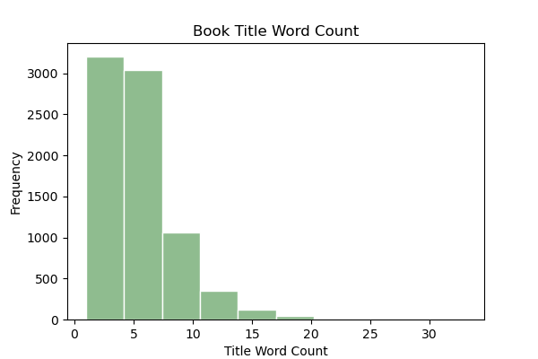

# Capstone Project - Book Rating Predictor & Recommender System


<p align="center">
  
</p>


### Problem Statement:


There's an _indescribable_ joy that accompanies the act of immersing oneself deep in the pages of a good book. The sheer delight of losing track of time while navagating the intricate landscapes of words, where characters come alive, and stories unravel like enchanting tapestries, is unmatched. Each book is a doorway to a new adventure, a chance to live a thousand lives, and an invitation to explore endless possibilities. Every devoted reader knows the inescapable obstacle that is conquering their **TBR (to-be-read) list.** A TBR list is a collection of books that an individual plans to read in the future. Many avid readers maintain TBR lists to help prioritize their reading choices and ensure they don't forget about books they want to experience. The unfortunate aspect of this list is that it is evergrowing and multiplies much quicker than the reader can keep up with. While I cannot help a reader consume books at a faster rate, I can help them determine which book from their TBR list should be read next. The goal of this project is two fold:

1. Create a predictive model to forcast, with at least 90% accuracy, what books from a TBR list should be read next 
2. Create a recommendation system, based off of nearly 6 million book ratings, to help readers continue to add to their TBR list

_This capstone is a passion project of mine, thank you for following along!_

### File Directory:

```
CAPSTONE
|__ code
|   |__ 01-EDA.ipynb
|   |__ 02-Cleaning.ipynb   
|   |__ 03-Recommender.ipynb
|   |__ 04-Modeling.ipynb 
|   |__ 05-DataFrame-Creation-TBR-List.ipynb     
|__ data
|   |__ books_for_binary_classification.csv
|   |__ recommend_big.csv
|   |__ recommend.csv
|   |__ tbr_list.csv
|__ ignore
|   |__ books_tags.csv
|   |__ books.csv
|   |__ ratings.csv
|   |__ tags.csv
|   |__ to_read.csv
|__ images
|   |__ amt_of_ratings_by_stars_eda.png
|   |__ book_id_pub_year.png
|   |__ book_title_length.png
|   |__ book_title_word_count.png
|   |__ bookimage.png
|   |__ books_heat_map.png
|   |__ data_erd.png
|   |__ num_ratings_by_stars_eda.png
|   |__ Ratings_Distribution.png
|   |__ Should_i_read_next_Distribution.png
|   |__ silly_sorting_hat.png
|   |__ Top 10 Most Frequently Published Authors.png
|   |__ Top 10 Most Frequently Published Language Codes.png
|   |__ top_25_most_common_tri_grams_in_titles.png
|   |__ top_25_most_common_words_in_titles.png
|__ Capstone - Kiersten Johns.pdf
|__ README.md
```


# Data Dictionary:

|Name|Dataset|Description|
|---|---|---|
|**books**|books_for_binary_classification.csv| 7,851 of the current "top 10,000 most popular books".
|**recommend**|recommend.csv| 90,661 book ratings from GoodReads.
|**recommend**|recommend_big.csv| 906,403 book ratings from GoodReads.
|**tbr list** | tbr_list.csv | My personal TBR list, comprised of 28 books, to be used as unseen data to check predictions.


# Executive Summary: EDIT THIS

### EDA:
The original GoodReads dataset came from [user zygmuntz's github](https://github.com/zygmuntz/goodbooks-10k/tree/master) and consisted of the following data:

|Name|Dataset|Description|
|---|---|---|
|**book tags**|book_tags.csv| Contains tags/shelves/genres assigned by users to books. Tags in this file are represented by their IDs. They are sorted by goodreads_book_id ascending and count descending.
|**books**|books.csv| Top 10,000 most popular books containing metadata for each book (goodreads IDs, authors, title, average rating, etc.). The metadata has been extracted from GoodReads.
|**ratings**|ratings.csv| Contains 6 million ratings sorted by time.
|**tags** | tags.csv | Translates tag IDs to names.
|**to read** | to_read.csv | Provides IDs of the books marked "to read" by each user, as user_id,book_id pairs, sorted by time. There are close to a million pairs.

    

**Below is a ERD (entity relationship diagram):**

<p align="center">
  
</p>

After exploring all seperate datasets, here are the key findings:

- The Top 10 Most Frequently Published Authors
<p align="center">
  
</p>

- There were 9,964 unique book titles. Some titles were duplicates, however, they were still unique books due to the fact that they had different authors. 

- The earliest publishing date is listed as -1750 and the newest publishing date is listed as 2017

- Multiple language codes are included in the list of 10,000 books. Here are the Top 10 Most Frequently Published Language Codes
<p align="center">
  
</p>

- 6 million books reviews (ratings) were provided, on a scale of 1-5, with 5 being the best rating. Here is the distribution of the ratings:
    - As can be seen, most of the ratings are 4's and 5's. Given the context of the data (the top 10,000 most popular books) this makes sense.
<p align="center">
  
</p>

- There were 34,252 unique tags provided by users 

- Here is the distribution of Title Length (by character)
    - As can be seen, the data is skewed right, with the majority of the titles being under 50 characters long. 
<p align="center">
  
</p>

- Let's take a look at this same distribution, but instead of character count, lets take a look at the word count.
    - Again, this data is skewed right, with the majority of book titles being under 10 words long
    - The longest title was 33 words longs!
<p align="center">
  
</p>

- Then, the top 25 most common words and trigrams of the titles were explored. Below are the findings:
<p align="center">
  
</p>

<p align="center">
  
</p>

### Cleaning:

#### Cleaning for the Recommendation System:

The ratings data encompassed of 6 million reviews. While more data is better... the initial assumption was that my computer could not handle creating a system using all 6 million reviews. To approach this, a random selection of 50,000 data points was chosed and a recommendation system was built off of that. Knowing that the recommender would improve with more datapoints, more and more were continuously added and put through the process of being turned into a recommender. This process is elaborated on in the section labeled **Recommender System**. During each iteration of selecting random data points, a check was performed to ensure the inclusion of some favorite books in the sample, as a good recommender system should encompass personal preferences. Surprisingly, the last recommendation system was eventually developed using the entire dataset of 6 million data points.

For the recommendation system, essential feautures included _user_id, rating, and title_. Therefore, a merge of book data frame and the ratings data frame was required in order to obtain all of that info. This was achieved via a left merge on the _book_id_. Further data refinement involved the exclusion of books not published in US - English (language code = eng or en-US). This resulted in a dataset of 5,419,126 data points to be worked with. Fortunately, no missing values were included in this dataset. Once the data was cleaned, extraneous features were dropped, and the updated CSV was saved.

#### Cleaning for Predictive Modeling:

The predictive models use the books dataset of the top 10,000 most popular books on GoodReads. Again, the initial thought was that computing power would not be able to handle 


- Binary classification was used to answer the question "should I read this book next". The process of how this classifcation was determined will be outlined below in the cleaning section. The distribution of 

### Recommender System


### Modeling Process


### Recommender System


### Conclusion: EDIT THIS


# Sources: EDIT THIS

- [zygmuntz/goodbooks-10k](https://github.com/zygmuntz/goodbooks-10k/tree/master)

- 